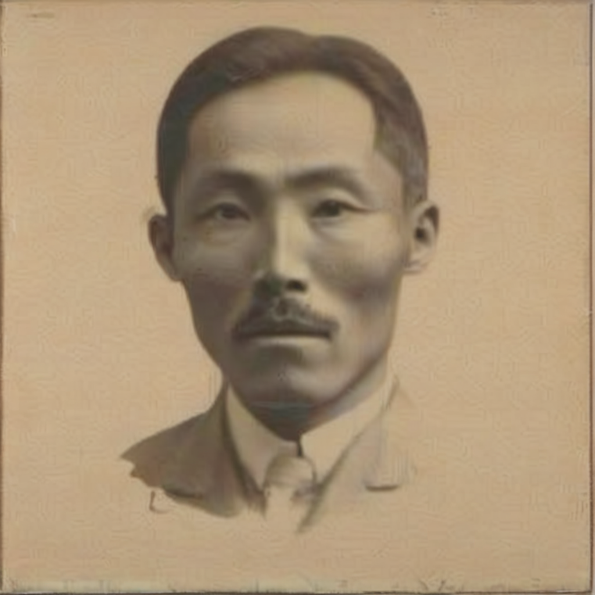
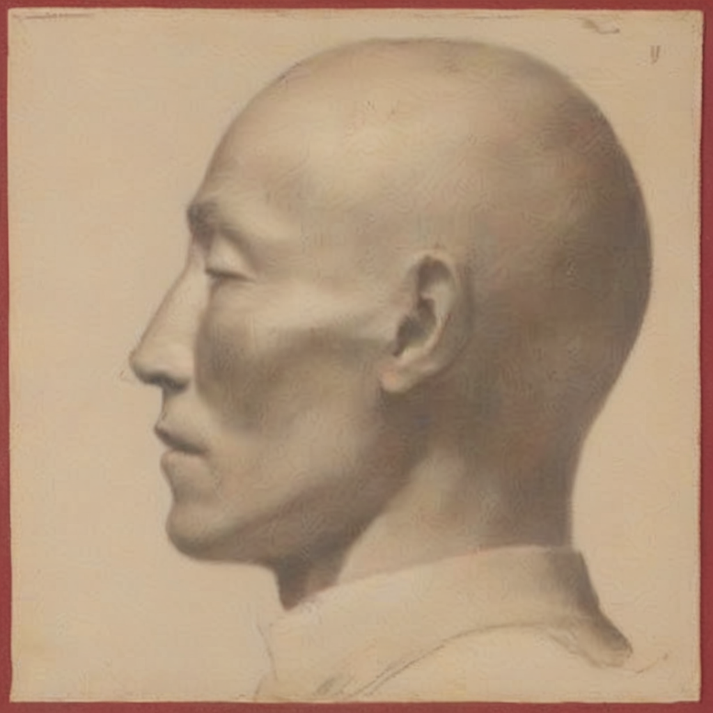
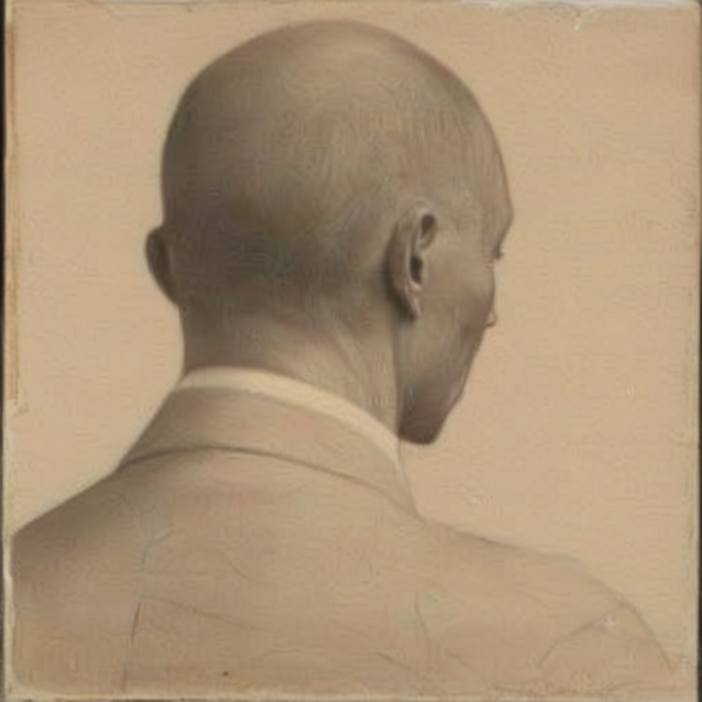
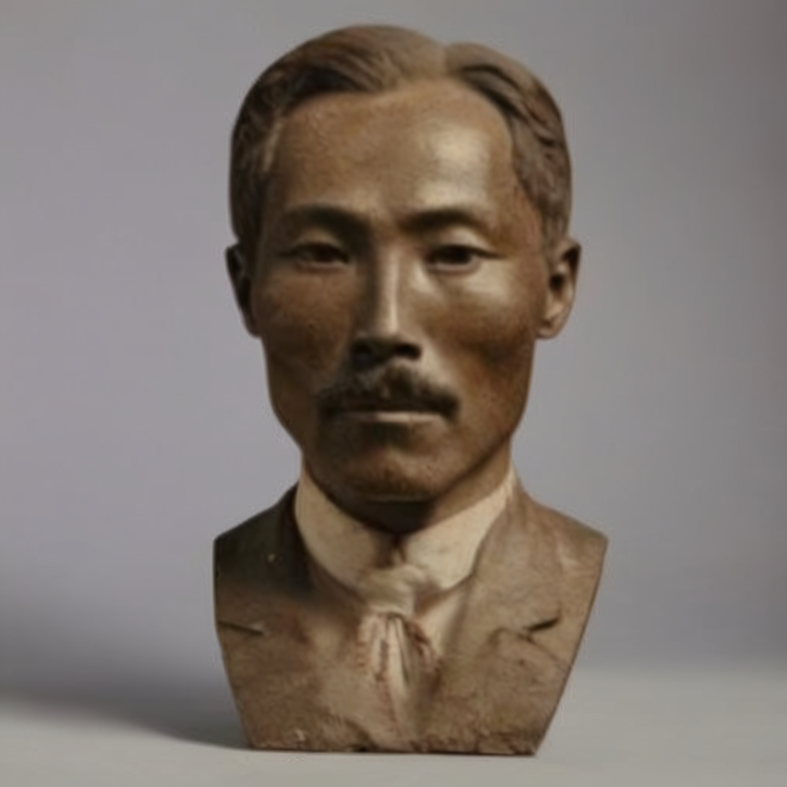
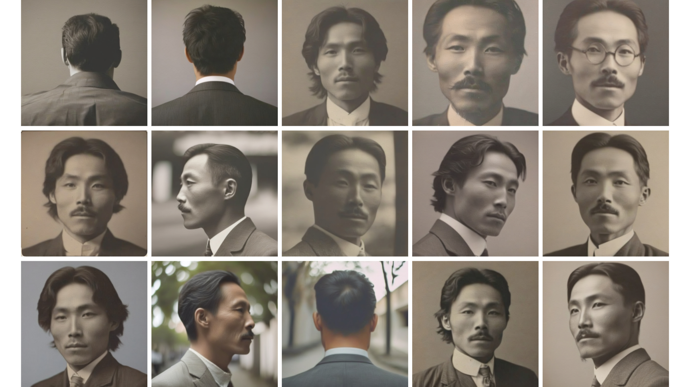
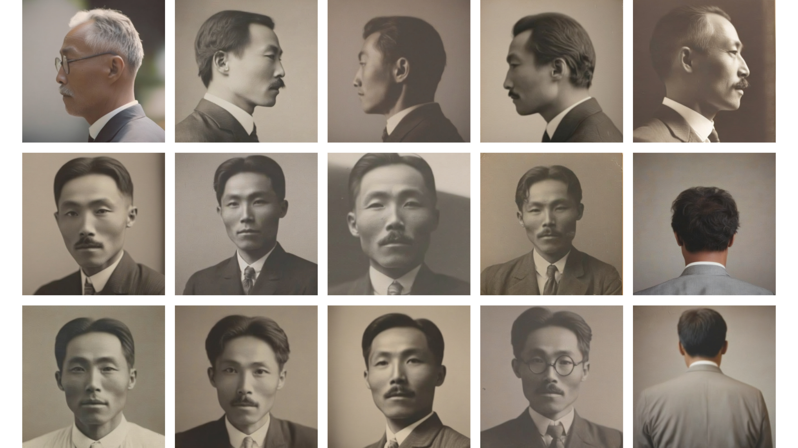
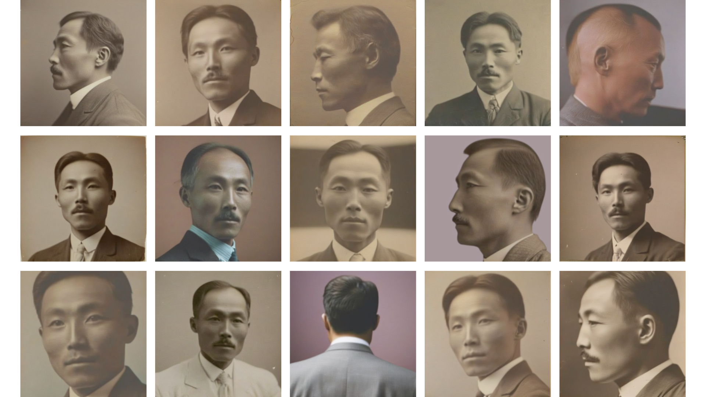
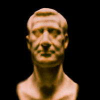

# **3D Reconstruction of Independence Activists Using Stable Diffusion**  
Generating 3D models of historical independence activists utilizing pretrained T2I 2D diffusion models.

---

## **Overview**  
This project aims to reconstruct **3D models** of Korean independence activists using diffusion-based generative models. By **fine-tuning** a pretrained **Stable-DreamFusion** model, we generate realistic **3D representations** from limited 2D images.

### **Cited Works**  
- **Stable-DreamFusion** [(GitHub: https://github.com/ashawkey/stable-dreamfusion)](https://github.com/ashawkey/stable-dreamfusion)  
- **DCO Fine-tuning Methodology** [(GitHub: https://github.com/kyungmnlee/dco)](https://github.com/kyungmnlee/dco)  
- **Our Works of Implementing Fine-tuned Model to DreamFusion** [(GitHub: wltschmrz)](https://github.com/wltschmrz/stable_dreamfusion_deprecated)  
---

## **Pipeline**  

### **1. Data Collection for Fine-tuning**  
We gathered **historical images** of Korean independence activists for model training. These images were preprocessed to enhance clarity and usability.  

**Dataset Preview:**  
📁 `/results/`  
- `/results/prepared_datas.jpg` [see data](/results/prepared_datas.jpg)
---

### **2. Fine-tuning with DCO**  
Using **DCO (DreamFusion Control Optimization)**, we adapted the diffusion model to better represent historical figures in a **3D-consistent** manner.  

**Fine-tuning Samples:**

<table align="center">
  <tr>
    <th style="text-align:center;">Generated Output</th>
    <th style="text-align:center;">Text Caption</th>
  </tr>
  <tr>
    <td align="center">
      
      
      
      
    </td>
    <td align="center">Reconstruction of [Changho An]</td>
  </tr>
  <tr>
    <td align="center"></td>
    <td align="center">"A_DSLR_photo_of_[Changho An]'s_head_with_full_hair"</td>
  </tr>
  <tr>
    <td align="center"></td>
    <td align="center">"A_DSLR_photo_of_[Changho An]'s_head_with_hair"</td>
  </tr>
  <tr>
    <td align="center"></td>
    <td align="center">"A_DSLR_photo_of_[Changho An]'s_head_with_hair_in_color"</td>
  </tr>
</table>

<table style="width:100%; text-align:center;">
  <tr>
    <th style="text-align:center;">Generated Output</th>
    <th style="text-align:center;">Text Caption</th>
  </tr>
  <tr>
    <td style="text-align:center;">
      
      
      
      
    </td>
    <td style="text-align:center;">Reconstructions of [Changho An]</td>
  </tr>
  <tr>
    <td style="text-align:center;"></td>
    <td style="text-align:center;">"A_DSLR_photo_of_[Changho An]'s_head_with_full_hair"</td>
  </tr>
  <tr>
    <td style="text-align:center;"></td>
    <td style="text-align:center;">"A_DSLR_photo_of_[Changho An]'s_head_with_hair"</td>
  </tr>
  <tr>
    <td style="text-align:center;"></td>
    <td style="text-align:center;">"A_DSLR_photo_of_[Changho An]'s_head_with_hair_in_color"</td>
  </tr>
</table>

---

### **3. 3D Sampling with DreamFusion**  
By leveraging **Stable-DreamFusion**, we reconstructed **3D volumetric samples** from the fine-tuned model. The results demonstrate a high level of consistency in identity preservation.

**Generated 3D Samples:**  
| A_photo_of_a_burger | A_DSLR_photo_of_a_squirrel | A_DSLR_photo_of_a_bust |
|-----------|-----------|-----------|
|  |  |  |

---

### **4. 3D Model Generation from Fine-tuned 2D Diffusion Model**  
Using the **fine-tuned 2D model**, we generated **high-fidelity 3D models** of independence activists. The results showcase realistic depth, shading, and facial structures.

**Final 3D Model Outputs:**  
📁 `/results/3D_models/`  
- `activist1.obj`  
- `activist2.obj`  
- `activist3.obj`  

---

## **Installation & Usage**  

### **Setup**
Clone the repository and install dependencies:
```bash
git clone https://github.com/wltschmrz/stable_dreamfusion_deprecated.git
cd stable_dreamfusion_deprecated
pip install -r requirements.txt

pip uninstall torch torchvision torchaudio -y
pip install torch==1.12.0+cu116 torchvision==0.13.0+cu116 torchaudio==0.12.0 --extra-index-url https://download.pytorch.org/whl/cu116
python -c "import torch; print(torch.__version__, torch.version.cuda, torch.cuda.is_available())"

wget https://developer.download.nvidia.com/compute/cuda/11.6.2/local_installers/cuda_11.6.2_510.47.03_linux.run
sudo sh cuda_11.6.2_510.47.03_linux.run --toolkit --silent

echo 'export PATH=/usr/local/cuda-11.6/bin:$PATH' >> ~/.bashrc
echo 'export LD_LIBRARY_PATH=/usr/local/cuda-11.6/lib64:$LD_LIBRARY_PATH' >> ~/.bashrc
echo 'export CUDA_HOME=/usr/local/cuda-11.6' >> ~/.bashrc

source ~/.bashrc

echo $PATH
echo $LD_LIBRARY_PATH
nvcc --version

cd /workspace/stable-dreamfusion/gridencoder
python setup.py build_ext --inplace
