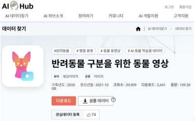
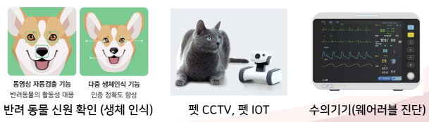

# CAT-FICIAL DECODER ฅ^•ﻌ•^ฅ
- 멀티모달을 활용한 유사도 기반 반려 동물 영상 행동 분석 AI
- Team 두더비(DoTheVision) 

## 1. Overview
- 바쁜 현대인들의 일상 속에서 집을 지키는 반려동물의 생활이 궁금할 때 도움을 주기 위함
- 홈캠 영상을 계속 보고 있는 대신, 영상을 이용해 텍스트로 된 설명을 추출하면 더욱 빠르게 무엇을 하고 있는지 알 수 있다! 

## 2. Dataset

**[Overview]**

- AIHUB 반려동물 구분을 위한 동물 영상 데이터
- CAT 폴더 활용
- 이미지, 라벨링 데이터로 구성
- Arch, Armstretch, Footpush, Getdown, Grooming, Heading, Laydown, Lying, Roll, Sitdown, Tailing, Walkrun 항목으로 구성

**[Preprocessing the Data]**
- 이미지 전처리 : 영상 프레임 수집 및 동기화, 이미지 변환, 이미지 패딩
- 텍스트 전처리 : 레이블 생성 및 번역(DeepL), 텍스트 토큰화 및 패딩

## 3. Model Architecture

**[기존 VisionGPT]**

- ViT와 GPT의 구조를 결합하여 이미지를 처리하는 멀티모달
  - Input : 한 장의 이미지
  - Output : 이미지에 대한 설명

**[변경사항]**

- 이미지 대신 비디오 영상 처리하도록 구조 변경
     1. 비디오를 프레임 여러 개로 나누기
     2. ViT로 각 프레임의 임베딩 벡터 추출
     3. 벡터들을 평균, 하나의 벡터로 변환
     4. 최종 벡터를 GPT에 넣어서 최종 비디오의 설명 생성

**[멀티모달 구조]**

- Cross Attention에서 GPT와 ViT 사이의 정보 교환이 이루어짐
  - query(gpt) : gpt에서 생성한 텍스트 토큰을 query로 사용
  - key/value(vit) : vit에서 생성한 이미지 임베딩을 key와 value로 사용
- 결론적으로 vit에서 생성한 이미지 임베딩을 gpt가 참조할 수 있도록 연결

## 4. Model Training

## 5. Results

## 6. About the Project

**[Significance]**

- 기존에는 이미지 데이터를 활용한 멀티모달이었는데 이를 확장하여 비디오 데이터도 처리가 가능하도록 가공
  
  - 4차원 데이터 : Channel, Width, Height + Frames 까지 총 4차원의 데이터를 다룸
    
    

 - Mean Pooling : 비디오를 다루는 모델을 찾는 것에 어려움이 있어서 분할된 프레임들을 mean pooling하는 방식으로 진행
    
    

 - Fine Tuning : 데이터가 비디오 특징을 더 잘 파악할 수 있도록 fine tuning 진행

**[Limitations]**
- 영상의 맥락을 파악해서 행동을 요약해주는 대신 프레임들의 평균으로 요약
- 비디오 데이터의 부재로 인해 프레임 데이터를 사용  
  

**[Future Work]**
- 반려 동물 개체별 행동 분석 응용 서비스 개발
  
  1) 반려 동물 신원 확인(생체 인식)
  2) 홈 캠을 수시로 확인하지 않아도 텍스트 리포트를 통해 반려동물의 하루 일과 확인할 수 있는 펫 CCTV, 펫 IOT
  3) 펫 로봇 (펫 장난감, 펫 피트니스 로봇)
  4) 급식 장비 (자동 급식, 급수 도구)
  5) 수의기기 (웨어러블 진단 기기)
 
  

