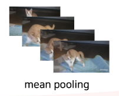

# CAT-FICIAL DECODER
- 멀티모달을 활용한 유사도 기반 반려 동물 영상 행동 분석 AI
- Team 두더비(DoTheVision) 

## 1. 데이터 개요

- AIHUB 반려동물 구분을 위한 동물 영상 데이터
- CAT 폴더 활용
- 이미지, 라벨링 데이터로 구성
- Arch, Armstretch, Footpush, Getdown, Grooming, Heading, Laydown, Lying, Roll, Sitdown, Tailing, Walkrun 항목으로 구성

## 2. 데이터 전처리
- 이미지 전처리 : 영상 프레임 수집 및 동기화, 이미지 변환, 이미지 패딩
- 텍스트 전처리 : 레이블 생성 및 번역, 텍스트 토큰화 및 패딩

## 3. 모델 구조

- ViT + GPT로 비디오 영상 처리하기
- 비디오를 프레임 여러 개로 나누기
- ViT로 각 프레임의 임베딩 벡터 추출
- 벡터들의 평균, 합산 등으로 하나의 벡터로 변환
- 최종 벡터를 GPT에 넣어서 최종 비디오의 설명 생성

- cross attention에서는 GPT와 ViT 사이의 정보 교환이 이루어짐
- query(gpt) : gpt에서 생성한 텍스트 토큰을 query로 사용
- key/value(vit) : vit에서 생성한 이미지 임베딩을 key와 value로 사용
- 결론적으로 vit에서 생성한 이미지 임베딩을 gpt가 참조할 수 있도록 연결

## 4. 모델 학습, 성능

## 5. 의의 및 발전 방안
- 기존에는 이미지 데이터를 활용한 멀티모달이었는데 이를 확장하여 비디오 데이터도 처리가 가능하도록 가공
- 데이터가 비디오 특징을 더 잘 파악할 수 있도록 fine tuning 진행

- Channel, Width, Height + Frames 까지 총 4차원의 데이터를 다룸

- 비디오를 다루는 모델을 찾는 것에 어려움이 있어서 초 단위로 분할된 프레임들을 mean pooling하는 방식으로 진행

- 반려 동물 개체별 행동 분석 응용 서비스 개발

  1) 반려 동물 신원 확인(생체 인식)
  2) 홈 캠을 수시로 확인하지 않아도 텍스트 리포트를 통해 반려동물의 하루 일과 확인할 수 있는 펫 CCTV, 펫 IOT
  3) 펫 로봇 (펫 장난감, 펫 피트니스 로봇)
  4) 급식 장비 (자동 급식, 급수 도구)
  5) 수의기기 (웨어러블 진단 기기)

